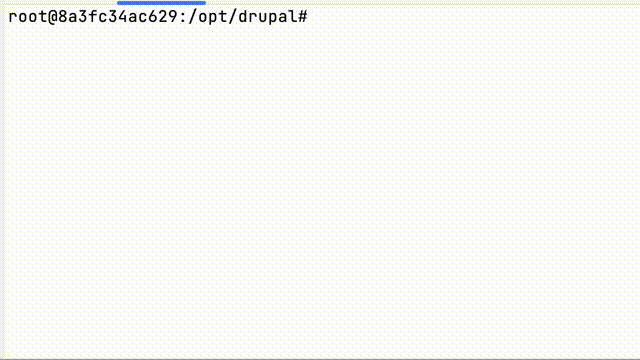

# Drall

Drall is a tool that helps run [drush](https://www.drush.org/) commands
on multi-site Drupal installations.

> One command to *drush* them all.
> — [Jigarius](https://jigarius.com/about)

A big thanks and shout-out to [Symetris](https://symetris.ca/) for sponsoring
the initial development of Drall.

## Preview



## Installation

Drall is listed on [Packagist.org](https://packagist.org/packages/jigarius/drall).
Thus, it can easily be installed using `composer` as follows:

    composer require jigarius/drall

## Placeholders

Drall's functioning depends on its _Placeholders_. Here's how Drall works
under the hood:

1. Receive a command, say, `drall exec -- COMMAND`.
2. Ensure there is a `@@placeholder` in `COMMAND`.
3. Run `COMMAND` after replacing `@@placeholder` with site-specific values.
4. Display the result.

Drall supports the following placeholders:

### @@dir

This placeholder is replaced with the name of the site's directory under
Drupal's `sites` directory. These are the values of the `$sites` array
usually defined in `sites.php`.

```php
# @@dir is replaced with "ralph" and "leo".
$sites['raphael.com'] = 'ralph';
$sites['leonardo.com'] = 'leo';
```

**Note:** In older versions of Drall, this was called `@@uri`.

### @@key

This placeholder is replaced with keys of the `$sites` array.

```php
# @@key is replaced with "raphael.com", "raphael.local" and "leonardo.com".
$sites['raphael.com'] = 'ralph';
$sites['raphael.local'] = 'ralph';
$sites['leonardo.com'] = 'leo';
```

### @@ukey

This placeholder is replaced with unique keys of the `$sites` array. If a site
has multiple keys, the last one is used as its unique key.

```php
# @@key is replaced with "raphael.local" and "leonardo.local".
$sites['raphael.com'] = 'ralph';
$sites['raphael.local'] = 'ralph';
$sites['leonardo.com'] = 'leo';
$sites['leonardo.local'] = 'leo';
```

### @@site

This placeholder is replaced with the first part of the site's alias.

```shell
# @@site is replaced with "@ralph" and "@leo".
@ralph.local
@leo.local
```

**Note:** This placeholder only works for sites with Drush aliases.

## Commands

To see a list of commands offered by Drall, run `drall list`. If you feel lost,
run `drall help` or continue reading this documentation.

### exec

With `exec` you can execute drush as well as non-drush commands on multiple
sites in your Drupal installation.

In Drall 2.x there were 2 exec commands. These are now unified into a single
command just like version 1.x.
- `drall exec:drush ...` is now `drall exec -- drush ...`
- `drall exec:shell ...` is now `drall exec -- ...`

#### Interrupting a command

When `drall exec` receives a signal to interrupt (usually `ctrl + c`), Drall
stops after processing the site that is currently being processed. This
prevents the current command from terminating abruptly. However, if a second
interrupt signal is received, then Drall stops immediately.

#### Drush with @@dir

In this method, the `--uri` option is sent to `drush`.

```shell
drall exec -- drush --uri=@@dir core:status
```

If it is a Drush command and no valid `@@placeholder` are present, then
`--uri=@@dir` is automatically added after each occurrence of `drush`.

```shell
# Raw drush command (no placeholders)
drall exec -- drush core:status
# Command that is executed (placeholders injected)
drall exec -- drush --uri=@@dir core:status
```

##### Example

```shell
drall exec -- drush core:status
```

#### Drush with @@site

In this method, a site alias is sent to `drush`.

```shell
drall exec -- drush @@site.local core:status
```

##### Example

```shell
drall exec -- drush @@site.local core:status
```

#### Non-drush commands

You can run non-Drush commands the same was as you run Drush commands. Just
make sure that the command has valid placeholders.

**Important:** You can only use any one of the possible placeholders, e.g. if
you use `@@dir` and you cannot mix it with `@@site`.

##### Example: Shell command

```shell
drall exec -- cat web/sites/@@uri/settings.local.php
```

##### Example: Multiple commands

```shell
drall exec "drush @@site.dev updb -y && drush @@site.dev cim -y && drush @@site.dev cr"
```

#### Options

For the `drall exec` command, all Drall options must be set right after
`drall exec`. Additionally, `--` must be used before the command to be
executed. Following are some examples of running `drush` with options.

```shell
# Drall is --verbose
drall exec --verbose -- drush core:status
# Drush is verbose
drall exec -- drush --verbose core:status
# Both Drall and Drush are --verbose
drall exec --verbose -- drush --verbose core:status
```

In summary, the syntax is as follows:

```shell
drall exec [DRALL-OPTIONS] -- drush [DRUSH-OPTIONS]
```

Besides the global options, the `exec` command supports the following options.

#### --interval

This option makes Drall wait for `n` seconds after processing each item.

```shell
drall exec --interval=3 -- drush core:rebuild
```

Such an interval cannot be used when using a multiple workers.

#### --workers

Say you have 100 sites in a Drupal installation. By default, Drall runs
commands on these sites one after the other. To speed up the execution, you
can ask Drall to execute multiple commands in parallel. You can specify the
number of workers with the `--workers=n` option, where `n` is the
number of processes you want to run in parallel.

Please keep in mind that the performance of the workers depends on your
resources available on the computer executing the command. If you have low
memory, and you run Drall with 4 workers, performance might suffer. Also,
some operations need to be executed sequentially to avoid competition and
conflict between the Drall workers.

##### Example: Parallel execution

The command below launches 3 instances of Drall to run `core:rebuild` command.

```shell
drall exec --workers=3 -- drush core:rebuild
```

When a worker runs out of work, it terminates automatically.

#### --no-progress

By default, Drall displays a progress bar that indicates how many sites have
been processed and how many are remaining. In verbose mode, this progress
indicator also displays the time elapsed.

However, the progress display that can mess with some terminals or scripts
which don't handle backspace characters. For these environments, the progress
bar can be disabled using the `--no-progress` option.

##### Example: Hide progress bar

```shell
drall exec --no-progress -- drush core:rebuild
```

#### --dry-run

This option allows you to see what commands will be executed without actually
executing them.

##### Example: Dry run

```shell
drall exec --dry-run --group=bluish -- drush core:status
```

### site:directories

Get a list of all available site directory names in the Drupal installation.
All `sites/*` directories containing a `settings.php` file are treated as
individual sites.

#### Example: Usage

```shell
drall site:directories
```

The output can then be iterated with scripts.

#### Example: Iterating

```shell
for site in $(drall site:directories)
do
  echo "Current site: $site";
done;
```

### site:keys

Get a list of all keys in `$sites`. Usually, these are site URIs.

#### Example: Usage

```shell
drall site:keys
```

The output can then be iterated with scripts.

#### Example: Iterating

```shell
for site in $(drall site:keys)
do
  echo "Current site: $site";
done;
```

### site:aliases

Get a list of site aliases.

#### Example: Usage

```shell
drall site:aliases
```

The output can then be iterated with scripts.

#### Example: Iterating

```shell
for site in $(drall site:aliases)
do
  echo "Current site: $site";
done;
```

## Global options

This section covers some options that are supported by all `drall` commands.

### --group

Specify the target site group. See the section *site groups* for more
information on site groups.

```shell
drall exec --group=GROUP -- drush core:status --field=site
```

If `--group` is not set, then the Drall uses the environment variable
`DRALL_GROUP`, if it is set.

### --filter

Filter placeholder values with an expression. This is helpful for running
commands on specific sites.

```shell
# Run only on the "leo" site.
drall exec --filter=leo -- drush core:status
# Run only on "leo" and "ralph" sites.
drall exec --filter="leo||ralph" -- drush core:status
```

For more on using filter expressions, refer to the documentation on
[consolidation/filter-via-dot-access-data](https://github.com/consolidation/filter-via-dot-access-data).

### --offset

An integer indicating the number of items to skip from the beginning. If a
negative integer is provided it is treated as `n - o`, where `n` is the total
number of items and `o` is the offset.

```shell
# Skip the first 2 items.
drall exec --offset=2 -- drush core:status
# Start at the 2nd item from the end.
drall exec --offset=-2 -- drush core:status
```

### --limit

An integer indicating the number of items to process.

```shell
# Stop after the first 2 items.
drall exec --limit=2 -- drush core:status
# Skip the first 2 items and process 3 items thereafter. Thus, only items
# 3, 4, 5 are processed.
drall exec --offset=2 --limit=3 -- drush core:status
```

### --silent

Display no output.

### --quiet

Display very less output.

### --verbose

Display verbose output.

### --debug

Display very verbose output.

## Auto-detect sites

Drall uses `sites.php` to determine site hostnames and site directories.
However, some Drupal multi-site installations do not have a `sites.php`
because the content of the `DRUPAL/sites` directory changes very frequently,
thereby making it difficult to maintain such a `sites.php`.

In such cases, it is suggested that you create a `DRUPAL/sites/sites.php`
based on [misc/example.sites.php](misc/example.sites.php) so that Drall can
detect the sites in your Drupal installation. Additionally, in this file you
can alter the `$sites` variable based on your requirements.

## Site groups

Drall allows you to group your sites so that you can run commands on these
groups using the `--group` option.

### Drall groups with site aliases

In a site alias definition file, you can assign site aliases to one or more
groups like this:

```yaml
# File: tnmt.site.yml
local:
  root: /opt/drupal/web
  uri: https://tmnt.com/
  # ...
  drall:
    groups:
      - cartoon
      - action
```

This puts the alias `@tnmt.local` in the `cartoon` and `action` groups.

### Drall groups with sites.*.php

If your project doesn't use site aliases, you can still group your sites using
one or more `sites.GROUP.php` files like this:

```php
# File: sites.bluish.php
$sites['donnie.drall.local'] = 'donnie';
$sites['leo.drall.local'] = 'leo';
```

This puts the sites `donnie` and `leo` in a group named `bluish`.

## Development

Here's how you can set up a local dev environment.

- Clone the `https://github.com/jigarius/drall` repository.
  - Use a branch as per your needs.
- Run `docker compose up -d`.
- Run `docker compose start`.
- Run `make ssh` to launch a shell in the Drupal container.
- Run `make provision`.
- Run `drall --version` to test the setup.
- Run `make lint` to run linter.
- Run `make test` to run tests.

You should now be able to `make ssh` and then run `drall`. A multi-site Drupal
installation should be present at `/opt/drupal`. Oh! And Drall should be
present at `/opt/drall`.

### Hosts

To access the dev sites in your browser, add the following line to your hosts
file. It is usually located at `/etc/hosts`. This is completely optional, so
do this only if you need it.

    127.0.0.1 tmnt.drall.local donnie.drall.local leo.drall.local mikey.drall.local ralph.drall.local

The sites should then be available at:
- [tmnt.drall.local](http://tmnt.drall.local/)
- [donnie.drall.local](http://donnie.drall.local/)
- [leo.drall.local](http://leo.drall.local/)
- [mikey.drall.local](http://mikey.drall.local/)
- [ralph.drall.local](http://ralph.drall.local/)

## Acknowledgements

- Thanks, [Symetris](https://symetris.ca/) for funding the initial development.
- Thanks, [Jigarius](https://jigarius.com/about) (that's me) for spending
  evenings and weekends to make this tool possible.
